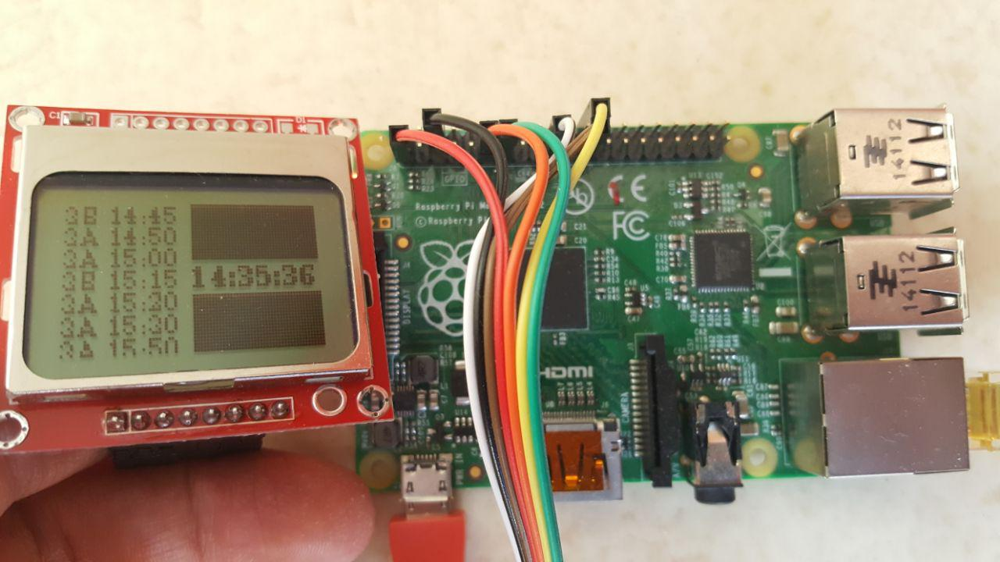
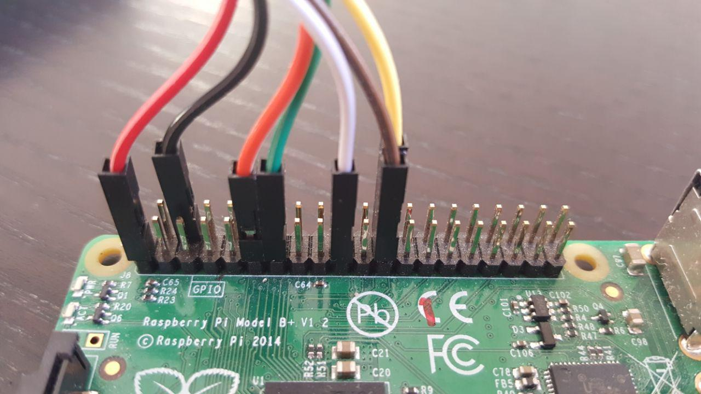
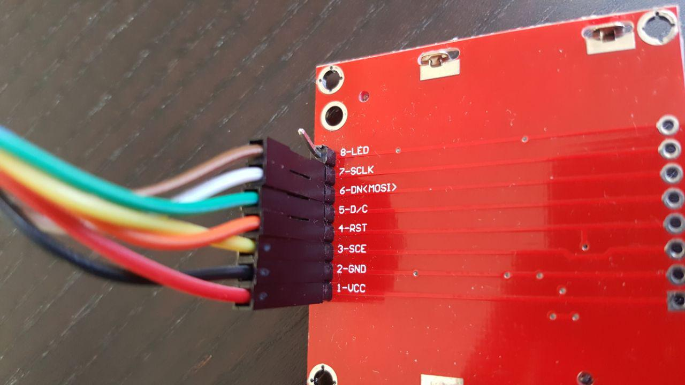

# Helsinki & Tampere public transportation display

This is a minimalist python software to display departing buses on given bus stops with raspberry pi connected to Nokia 5510 LCD.



## Installation

1. Clone this repository
2. [Request access to Tampere Public Transport API](http://developer.publictransport.tampere.fi/pages/en/account-request.php). If you use HSL, skip this step.
3. Copy & paste into `src/config.py`:
```python
# Provider is "HSL" or "TKL"
PROVIDER = "TKL"

# Only needed if PROVIDER == "TKL"
TKL_USER = "YOUR-API-USERNAME"
# Only needed if PROVIDER == "TKL"
TKL_PASS = "YOUR-API-PASSWORD"

# The interval of calling the public API
API_CALL_INTERVAL_SECONDS = 20 * 60

# Use whatever bus stop codes and bus line numbers.
# The codes can be found from API documentation of TKL & HSL.
# The format is (BusStopCode, BusStopNameWhichIsNotInUseYet, [LineNumbers])
BUS_STOP_CODES = [
    ("3607", "Nayt.katu", ["3A"]),
    ("3601", "Arkk.katu", ["3B"]),
]
```
4. Install dependencies
5. [Optional] For automatic startup add to `/etc/crontab`:
```
@reboot root python /home/{USER}/{LOCATION}/joukkoliikenne-rpi/src/main.py >> /home/{USER}/joukkoliikenne.log 2>&1
```

## Dependencies

[Adafruit Nokia LCD library](https://github.com/adafruit/Adafruit_Nokia_LCD)

## Tampere Public Transport API

- [Documentation](http://wiki.itsfactory.fi/index.php/TRE_API_Public_Transport)

## Hardware

- Raspberry PI
- Female-Female Jumper Wires, [like these](http://www.dx.com/p/diy-female-to-female-dupont-breadboard-jumper-wires-black-multi-color-40-pcs-10cm-343484)
- Nokia 5110 LCD, [like this](https://www.adafruit.com/product/338)

## Pin setup




